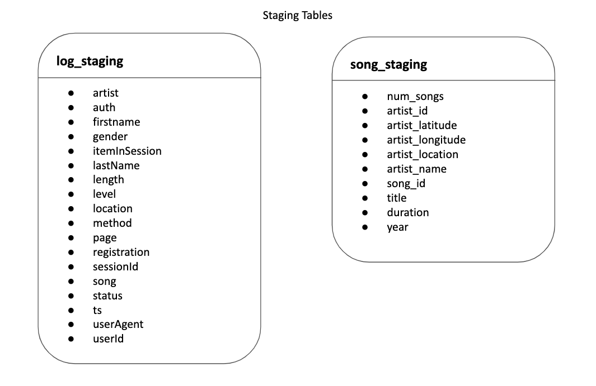

# ETL with AWS Redshift (Cloud Datawarehousing)
This project builds an ETL pipeline using Amazon Redshift. It is a part of Udacity's Data Engineering Nanodegree program.

## Project Description
The project buils an ETL pipeline from copying the data from the s3 buckets to data modelling in Redshift. It uses Infrastructure-as-Code structure to handle Amazon Web Services.<br>
We follow the below process: <br>
- Create IAM Role and attach policy
- Create Redshift Cluster
- Read data from S3 buckets and copy them to a staging area in the cluster
- From the staging area, read the data and insert the rows in fact and dimension tables
- Delete the cluster<br><br>
**Note:** For verification of the data inserted in the tables we perform three queries which is provided in the later section in this file. <br>
#### Why Redshift?
:notebook:  Amazon Redshift is a <b>fully managed, cloud-based, petabyte-scale</b> data warehouse service by Amazon Web Services (AWS).<br>
:notebook:  Exceptionally fast - massively parallel processing(MPP). <br>
:notebook:  High performance using massive parallelism, efficient data compression, query optimization, and distribution.<br>
:notebook:  Horizontally scalable.<br>
:notebook:  Enhanced security<br>

## Data Modelling with Redshift
Below is the table definition of Staging Tables: <br>


Below is the table definitions of Fact and Dimension Tables: <br>


## Getting Started
### Pre-requisites
- Python 3.5 and above --> For more details https://www.python.org/
- Account in AWS --> For more details https://aws.amazon.com/what-is-aws/
  - Create an IAM user --> https://docs.aws.amazon.com/IAM/latest/UserGuide/id_users_create.html
  - Get your SECRET KEY and ACCESS KEY and save it in your local machine --> https://docs.aws.amazon.com/general/latest/gr/aws-sec-cred-types.html
  
### Running the project
<b>STEP 1:</b>  Open dwh.cfg file and set KEY and SECRET with your AWS ACCESS KEY and AWS SECRET KEY respectively. <br>
<b>STEP 2:</b> Create and run the environment
```
$ python3 -m venv virtual-env-name
$ source virtual-env-name/bin/activate
$ pip install -r requirements.txt
```
<b>STEP 3:</b> Run the below command
```
$ python aws_starter --action create
```
The <iamrole> and redshift cluster's <endpoint_address> will be returned. Save it somewhere!<br>
<b>STEP 4:</b> Copy cluster's endpoint in from=nt of --host and iamrole arn in front of --iamrole wherever needed in below commands and run them in order:
```
$ python create_tables.py --host <endpoint_address>
$ python etl.py --host <endpoint_address> --iamrole <iamrole>
```
<b>STEP 5:</b> Execute all the cells line by line in analytics.ipynb to verify the data.<br>
<b>STEP 6:</b> Delete the cluster <b>VERY IMPORTANT!</b>
```
$ python aws_starter --action delete
```

### Project Structure
- <b>analytics.ipynb</b> (contains SQL queries for anlytical purpose i.e. to verify the data)
- <b>aws_starter.py</b> (main script to run the aws via infrasructure-as-code)
- <b>aws_utils.py</b> (utility functions to access AWS redshuft service)
- <b>clients.py</b> (define clients for ec2, iam, redshift and s3)
- <b>create_tables.py</b> (creates schema, drops tables and creates tables)
- <b>dwh.cfg</b> (configuration file)
- <b>etl.py</b> (contains code for copying and inserting data)
- <b>sql_queries.py</b> (contains sql queries)
- <b>.gitignore</b>
- <b>img/</b> (contains images for readme file)
- <b>README.md</b>

### Queries
Below three queries can be used to veify the data: <br>
1. Outputs the table names.
```
SELECT t.table_name
FROM information_schema.tables t
WHERE t.table_schema = 'sparkify'
ORDER BY t.table_name;
```
2. Outputs the 10 song names and their artists
```
query = """
SELECT s.title, a.name
FROM {}.songplays sp
INNER JOIN {}.songs s ON s.song_id = sp.song_id
INNER JOIN {}.artists a ON a.artist_id = sp.artist_id
GROUP BY a.name, s.title
LIMIT 10
""".format(DWH_SCHEMA, DWH_SCHEMA, DWH_SCHEMA)
```
3. Outputs the 10 artist names and their locations.
```
query = """
SELECT name,location
FROM {}.artists
LIMIT 10
""".format(DWH_SCHEMA)
```

### Authors
* **Rupali Sinha** - *Initial work*
